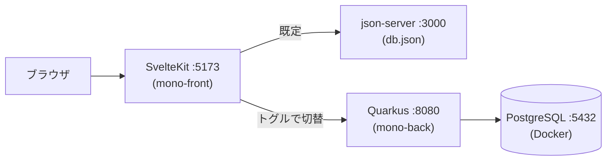

# Monocrea Technical Training

フロントエンド(SvelteKit + Svelte 5)とバックエンド(Quarkus + PostgreSQL)で構成される技術研修の成果物です。

## 概要

検索・ソート・ページングに対応したユーザー一覧と、ユーザーの作成・更新・削除(CRUD)を提供します。研修 3 フェーズの成果を 1 つのアプリに統合しており、画面上の操作で切り替えて確認できます。

| 研修フェーズ | 確認方法 |
|---|---|
| Svelte チュートリアル | `/`(チュートリアル画面) |
| フロントエンド実践 | `/users` をモック API(json-server)で動作 |
| バックエンド実践 | `/users` を実 API(Quarkus + PostgreSQL)で動作 |

フロントエンドのコードを変更することなく、ヘッダーのトグルで接続先を json-server ↔ Quarkus に切り替えられます。

## 構成



## 技術スタック

| 領域 | 技術 |
|---|---|
| フロントエンド | SvelteKit 2 / Svelte 5(Runes)/ TypeScript / Vite 7 / pnpm |
| フロントエンド(テスト・他) | Vitest + Testing Library / Pico CSS / Paraglide(i18n) |
| モック API | json-server |
| バックエンド | Quarkus 3.34 / Java 21 / Maven |
| バックエンド(主な拡張) | Hibernate ORM Panache / Flyway / Hibernate Validator / REST(Jackson) |
| バックエンド(テスト) | JUnit 5 + REST Assured |
| データベース | PostgreSQL 18(Docker) |

## プロジェクト構成

```
mono-training/
├── docker-compose.yml              # PostgreSQL(Quarkus モードで使用)
├── mono-front/                     # SvelteKit フロントエンド
│   ├── db.json                     # json-server のモックデータ
│   ├── messages/                   # 多言語メッセージ(i18n)
│   └── src/
│       ├── lib/
│       │   ├── core/               # 汎用基盤(http / list / table / pagination)
│       │   └── app/
│       │       ├── shared/         # アプリ共通(backend 切替 / error / toast / pending ...)
│       │       └── feature/        # 機能単位(user / tutorial)
│       └── routes/                 # 画面(/ チュートリアル, /users ユーザー管理)
└── mono-back/                      # Quarkus バックエンド
    └── src/main/
        ├── java/jp/co/monocrea/
        │   ├── core/               # 汎用基盤(ページング / エラー / 論理削除)
        │   ├── app/                # アプリ共通(例外マッピング / クエリ)
        │   └── feature/user/       # 機能単位(resource → service → repository → entity)
        └── resources/
            ├── application.properties
            └── db/migration/       # Flyway マイグレーション(テーブル作成 + シード)
```

## 前提条件

以下がインストール済みであることを確認してください。

| ソフトウェア | バージョン |
|---|---|
| Git | - |
| Node.js | 22 以上(LTS) |
| pnpm | 10 系 |
| JDK | 21(Amazon Corretto 21 推奨) |
| Docker Desktop | - |

Maven のインストールは不要です(Maven Wrapper `mvnw` を同梱しています)。

<details>
<summary>参考: 前提ソフトウェアのインストール手順(OS 別)</summary>

汎用ツールですが、環境構築の参考として OS 別の例を記載します。

### Windows (Chocolatey)

PowerShell を管理者として起動し、[Chocolatey](https://chocolatey.org/install) をインストールします。

```powershell
Set-ExecutionPolicy Bypass -Scope Process -Force; [System.Net.ServicePointManager]::SecurityProtocol = [System.Net.ServicePointManager]::SecurityProtocol -bor 3072; iex ((New-Object System.Net.WebClient).DownloadString('https://chocolatey.org/install.ps1'))
```

続けて、各ソフトウェアをインストールします。

```powershell
choco install -y git
choco install -y nodejs-lts
choco install -y pnpm
choco install -y corretto21jdk
choco install -y docker-desktop
```

### macOS (Homebrew)

ターミナルを起動し、[Homebrew](https://brew.sh/) をインストールします。

```sh
/bin/bash -c "$(curl -fsSL https://raw.githubusercontent.com/Homebrew/install/master/install.sh)"
```

続けて、各ソフトウェアをインストールします。

```sh
brew install git
brew install pnpm
brew install corretto@21
brew install docker --cask
```

Node.js は [nodebrew](https://github.com/hokaccha/nodebrew) で LTS を導入します。

```sh
brew install nodebrew
nodebrew setup
echo 'export PATH=$PATH:$HOME/.nodebrew/current/bin' >> ~/.bash_profile
# <version> は Node.js 22 以上の最新 LTS(https://github.com/nodejs/Release)に置き換える
nodebrew install-binary <version>
nodebrew use <version>
```

</details>

## セットアップと起動

### インストール(初回のみ)

```sh
git clone https://github.com/khkmgch/mono-training.git
cd mono-training/mono-front
pnpm install
```

### 起動

**最初に Docker Desktop を起動してください**

その後、以下の 4 つをそれぞれ別のターミナルで起動します。

| # | 実行場所 | コマンド | 起動確認 |
|---|---|---|---|
| 1 | リポジトリルート | `docker compose up -d` | `docker compose ps` が `healthy` |
| 2 | `mono-back/` | `./mvnw quarkus:dev`<br>(Windows: `.\mvnw.cmd quarkus:dev`) | http://localhost:8080/users が JSON を返す |
| 3 | `mono-front/` | `pnpm mock` | http://localhost:3000/users が JSON を返す |
| 4 | `mono-front/` | `pnpm dev` | http://localhost:5173 が表示される |

ブラウザで http://localhost:5173 を開き、ヘッダーのトグルで json-server ↔ Quarkus を切り替えて両モードを確認します。

## バックエンドの切替

ヘッダー右上のトグルで、 API 接続先を切り替えられます。選択は Cookie に保存され、リロード後も維持されます。json-server と Quarkus は同一のリソース設計のため、同じ画面が両方のバックエンドで動作します。

| 選択 | 接続先 |
|---|---|
| json-server (mock) | http://localhost:3000 |
| Quarkus (api) | http://localhost:8080 |

## API 仕様

Quarkus が提供する REST API です(ベース URL: `http://localhost:8080`)。

| メソッド | パス | 説明 | 主なステータス |
|---|---|---|---|
| GET | `/users` | 一覧(ページング・ソート・絞り込み) | 200 |
| GET | `/users/{id}` | 詳細 | 200 / 404 |
| POST | `/users` | 作成(`loginId`, `fullName`) | 201 / 409 / 422 |
| PATCH | `/users/{id}` | 更新(`loginId`, `fullName`, `version`) | 200 / 404 / 409 / 422 |
| DELETE | `/users/{id}?version={version}` | 削除(論理削除) | 204 / 404 / 409 |

`GET /users` のクエリパラメータ:

| パラメータ | 説明 | 例 |
|---|---|---|
| `page` | ページ番号(0 始まり) | `page=1` |
| `size` | 1 ページの件数(既定 20・最大 100) | `size=50` |
| `sort` | 並び替え。`フィールド,方向`(asc / desc、省略時 asc)。対象は `loginId` / `fullName` / `updatedAt` | `sort=loginId,desc` |
| `loginId` | ログイン ID の部分一致(大文字小文字を区別しない) | `loginId=user01` |
| `fullName` | 氏名の部分一致(大文字小文字を区別しない) | `fullName=tanaka` |

- 並び替えは画面では単一列のみです。複数列ソートは API で `sort` を繰り返し指定した場合にのみ有効です(例: `sort=fullName,asc&sort=loginId,desc`)
- 一覧レスポンスは `items` / `page` / `size` / `totalCount` / `totalPages` を返します
- 更新・削除は `version` による楽観ロックで同時更新を検出します(競合時 409)
- エラーは RFC 9457(`application/problem+json`)形式で、バリデーションエラー(422)はフィールド単位の情報を含みます

## テスト

| 対象 | 実行場所 | コマンド |
|---|---|---|
| フロントエンド | `mono-front/` | `pnpm test` |
| バックエンド | `mono-back/` | `./mvnw test`(Windows: `.\mvnw.cmd test`) |

バックエンドのテストは Quarkus Dev Services がテスト専用の PostgreSQL コンテナを自動起動するため、Docker Desktop の起動が必要です(開発用 DB には影響しません)。
